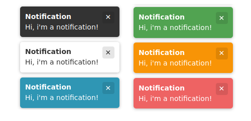

# Toast-js

## Installation
```bash
npm i @brenoroosevelt/toast
```

## Usage
```js
import toast from '@brenoroosevelt/toast'

toast.system ("Hi, i am a notification", /** options = {} */) 
toast.info   ("Hi, i am a notification", /** options = {} */)
toast.warning("Hi, i am a notification", /** options = {} */)
toast.error  ("Hi, i am a notification", /** options = {} */)
toast.success("Hi, i am a notification", /** options = {} */)
toast.create ("Hi, i am a notification", /** options = {} */)
```

## Default Options
| Attribute   | Type                                                               | Default   | Values / Description                                                                                  |
|-------------|--------------------------------------------------------------------|-----------|-------------------------------------------------------------------------------------------------------|
| type        | string                                                             | default   | default, system, error, info, warning, success                                                        |
| title       | string                                                             | undefined | notification title                                                                                    |
| position    | string                                                             | top       | top, bottom                                                                                           |
| align       | string                                                             | end       | start, center, end                                                                                    |
| bgColor     | string                                                             | #333      | css background-color                                                                                  |
| color       | string                                                             | #fff      | css text color                                                                                        |
| duration    | number                                                             | 10000     | time in ms, 0 to disable                                                                              |
| closeBtn    | boolean                                                            | true      | show close button                                                                                     |
| zIndex      | number                                                             | 99999     | css z-index                                                                                           |
| dismissible | boolean                                                            | true      | dismiss on click                                                                                      |
| shadow      | boolean                                                            | true      | display shadow                                                                                        |
| animateIn   | number                                                             | 200       | animation time in ms; 0 to disable                                                                    |
| animateOut  | number                                                             | 150       | animation time in ms; 0 to disable                                                                    |
| append      | boolean                                                            | true      | notifications will be added to the bottom/top of the list; (append=true: bottom), (append=false: top) |
| maxWidth    | number                                                             | 600       | max width in px                                                                                       |
| actions     | [{<br/>text: string, <br/>value: any, <br/>bgColor?: string, <br/>color?: string<br/>}] | []        | button actions                                                                                        |

```js
import toast from '@brenoroosevelt/toast'

toast.types.default.dismissible = false
toast.types.default.maxWidth = 300

toast.create("Hello notification")  // type: default
```

## Custom Types
```js
import toast from '@brenoroosevelt/toast'

// define new custom type
toast.types.setType('myType', {bgColor: "blue", position: "bottom", duration: 3000})
toast.create("Hello error", {type: "myType"})

// override a built-in type configurantion
toast.types.setType('error', {position: "top", align: "center"})
toast.error("Hello error")
```

## Promise based
```js
toast.info("hi, i m a notification").then((result) => console.log(result))
    
toast.create("Notification with actions", {
    position: "top",
    actions: [
        {text: "Yes", value: "ok"},
        {text: "No", value: "no"},
    ]
}).then((result) => {
    if (result.value === "ok") console.log("user says `yes`")
    if (result.value === "no") console.log("user says `no`")
    if (result.value === "click") console.log("user click to dismiss")
    if (result.value === "close-btn") console.log("user click close button")
    if (result.value === "timeout") console.log("notification has timed out")
})
```

## CSS override
```css
div.br-toast-container {
    margin: 50px;  /*your value*/
}

#toast-container-top-center { /* bottom|top, start|center|end */
    margin-top: 50px;  /*your value*/
}

div.br-toast-element {
    border-radius: 0;  /*your value*/
}

div.br-toast-close-btn {
    /*your value*/
}

p.br-toast-message {
    /*your value*/
}

p.br-toast-title {
    /*your value*/
}

button.br-toast-title {
    /*your value*/
}
```

## License
This project is licensed under the terms of the MIT license.

